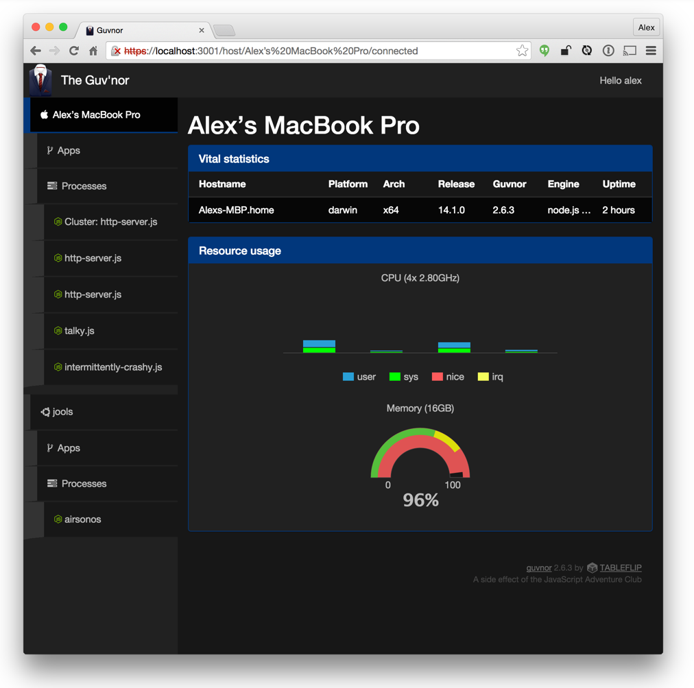
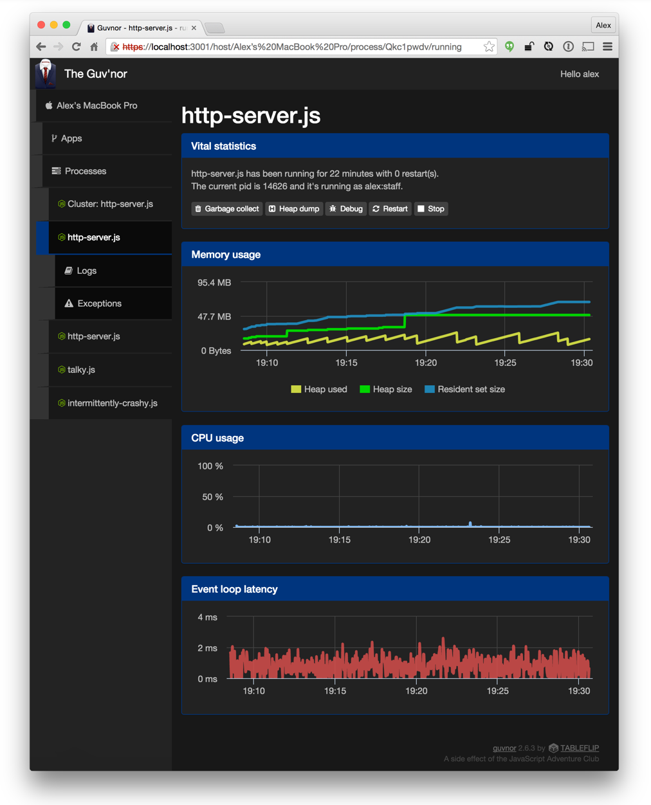
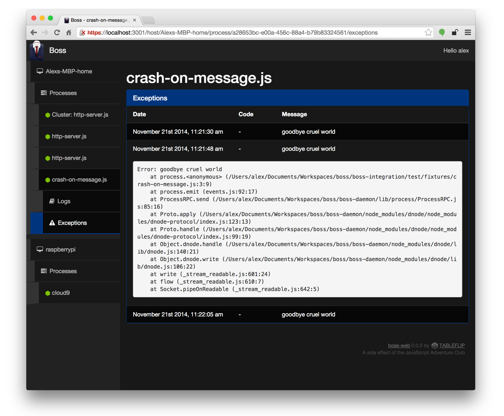
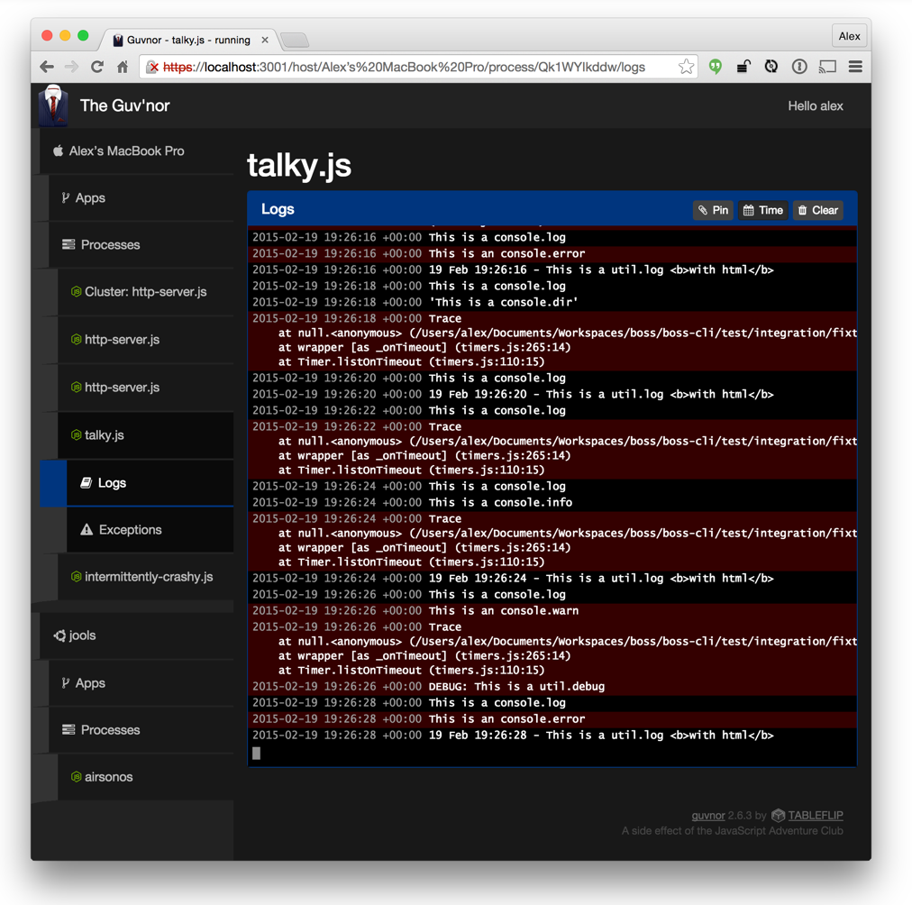

# Help

1. [Starting and stopping processes](processes.md)
1. [Controling the Daemon](daemon.md)
1. [Managing clusters](clusters.md)
1. [Installing and running apps](apps.md)
1. [Remote access and monitoring (e.g. boss-web)](remote.md)
1. Web interface
1. [Web interface - configuration](web-config.md)
1. [Web interface - user management](web-uesrs.md)
1. [Programmatic access](programmatic-access.md)
1. [Programmatic access - local](programmatic-access-local.md)
1. [Programmatic access - remote](programmatic-access-remote.md)
1. [Programmatic access - events](programmatic-access-events.md)

## boss-web

A web interface for the [boss](http://github.com/tableflip/boss) node.js process manager.

Memory usage and per-core CPU load:



Process usage graphs including heap size, resident set size, CPU, etc.



See stack traces for the uncaught exceptions that took your app down



Live logs for your process



### Prerequisites

 1. Boss installed on one or more servers
 2. A modern web browser

### Setup

Here `$CONFIG_DIR` is `/etc/boss` if you are root or `$HOME/.config/boss` if you are not.  

Unless you want it to listen on privileged ports (e.g. 80 or 443), you do not need to be root to run boss-web.

It's generally advised to not run processes as root unless you absolutley have to, so please consider running boss-web as a non-priveleged user.

#### Step 1. Create a user to log in as

```sh
$ bs-web useradd alex
```

#### Step 2. On the machine Boss is running on, obtain the host config

```sh
$ sudo bs remoteconfig

Add the following to your bossweb-hosts file:

[foo-bar-com]
  host = foo.bar.com
  port = 57483
  user = root
  secret = ZD57XFx6sBz....
```

Create a file named `$CONFIG_DIR/bossweb-hosts` with the output from the `remoteconfig` command.

#### Step 3. Still on the Boss machine, add a remote user

```sh
$ sudo bs useradd alex

[alex.foo-bar-com]
  secret = LsYd5UaH...
```

The file `$CONFIG_DIR/bossweb-users` should have been created during step 1 - open it and add the output from `useradd`.

#### Step 3a.  Optionally override which user you connect as

If you wish to log in to boss-web as `alex`, but need to administer a process running on a remote host as `alan`, you can override the user you connect to a given server in `$CONFIG_DIR/bossweb-users`:

```sh
[alex.foo-bar-com]
  user = alan
  secret = LsYd5UaH...
```

#### Step 4. Start boss-web

```sh
$ bs-web
```

### Running boss-web with boss

Ouroboros style:

```sh
$ bs start /usr/local/lib/node_modules/boss-web
```

### Every time I restart boss-web I have to re-accept a self-signed certificate!

[Let's Encrypt](https://letsencrypt.org/) still future tech?  Generate a 30 day self-signed certificate with:

```sh
$ bs-web genssl 30
```

If the number of days is omitted it defaults to one year.

Alternatively if you've bought an SSL certificate, configure boss-web according to the comments in the `[https]` section of the [default configuration](./bossweb) file.
